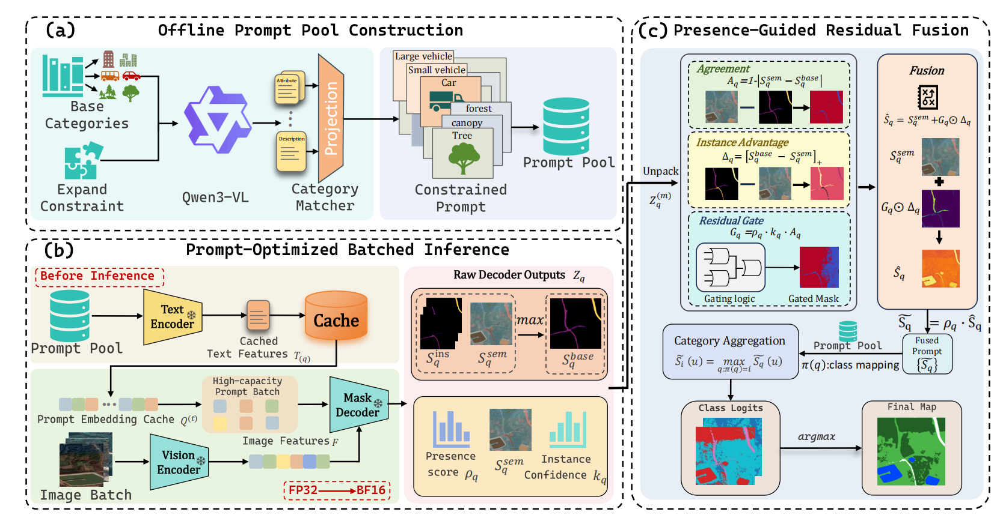
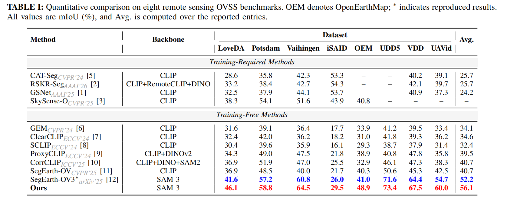

# ProC‑SAM3: Prompt‑Calibrated SAM 3 for Open‑Vocabulary Remote Sensing Semantic Segmentation

[](https://opensource.org/licenses/MIT)
[](https://www.python.org/downloads/)
[](https://pytorch.org/)

## Overview



**ProC‑SAM3** (Presence‑Guided Residual Fusion) enhances SAM 3 with multimodal prompting from Qwen‑VL. It combines vision‑language understanding and advanced segmentation to achieve state‑of‑the‑art open‑vocabulary semantic segmentation on remote sensing images.

## Key Features

- **Multimodal prompting** – text + optional visual prompts  
- **Robust fusion** of multiple prompt expansions  
- **Training‑free** – works off‑the‑shelf with SAM 3 + Qwen‑VL  
- **High accuracy** – outperforms previous methods across 8 datasets  

## Datasets

We evaluate ProC‑SAM3 on eight diverse remote sensing benchmarks.  
All data preprocessing follows the instructions from [SegEarth‑OV](https://github.com/likyoo/SegEarth-OV/blob/main/dataset_prepare.md).

- LoveDA, Potsdam, Vaihingen, iSAID  
- OEM, UDD5, VDD, UAVid  

## Results

The table below reports **mIoU** (%) for open‑vocabulary semantic segmentation.  
Our method achieves the highest average performance across all datasets.



## Installation

1. **Clone the repository**  
   ```bash
   git clone https://github.com/YanghuiSong/ProC-SAM3.git
   cd ProC-SAM3
   ```

2. **Set up the environment**  
   Follow the official [SAM 3 installation guide](https://github.com/facebookresearch/sam3) to prepare the environment (our code is built on top of SAM 3).

3. **Download required models**  
   - [Qwen3‑VL‑8B‑Instruct](https://huggingface.co/Qwen/Qwen3-VL-8B-Instruct)  
   - [SAM 3 checkpoint](https://huggingface.co/facebook/sam3) (from the official Meta repository)

4. **Configure paths**  
   Update the model paths in `config.py` to point to your local checkpoints.

## Run Evaluation on a Dataset

```bash
python eval.py --config configs/cfg_DATASET_pgrf_max.py
```

Replace `DATASET` with the desired dataset name (e.g., `vaihingen`, `potsdam`).

## Visualization

```bash
python visualize_segmentation.py --input-path images/ --output-dir results/
```

## Acknowledgments

This work is based on [SAM 3](https://github.com/facebookresearch/sam3) and [SegEarth‑OV3](https://github.com/earth-insights/SegEarth-OV-3). We thank the authors for their excellent open‑source contributions.
